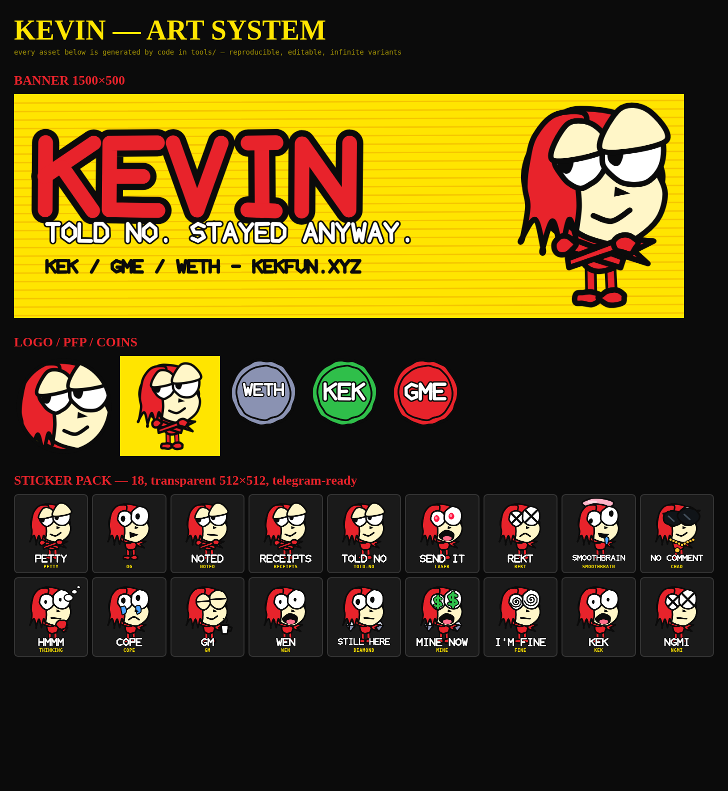

# KEVIN

**Told no. Stayed anyway.**

Brand, art system, sticker packs, launch spot and website for Kevin — a meme
coin launching through the [kekfun](https://kekfun.xyz) launchpad on Robinhood
Chain.

Everything here is generated from code. No image models, no stock assets, no
licensing questions: the character is built from vector primitives in
`tools/`, so any mood, prop or caption is a few lines away and re-running the
generator produces byte-identical output.



- **Site** → [iamkevin.lol](https://iamkevin.lol)
- **Lore** → [`docs/LORE.md`](docs/LORE.md) — read this before writing a single word of copy
- **Brand rules** → [`docs/BRAND.md`](docs/BRAND.md)
- **Launch checklist** → [`docs/LAUNCH.md`](docs/LAUNCH.md)

---

## Run the site

It's static — no build step, no dependencies, no framework.

```bash
python3 -m http.server 8000
# → http://localhost:8000
```

Open `index.html` directly and it works too, though the download attributes
behave better over HTTP.

## Change launch details

**Edit `js/config.js` and nothing else.** Contract address, socials, auction
dates, pool weights, burn receipts and ticker lines all live there. Anything
left `null` renders as "TBA" on the page rather than a made-up number — that
is deliberate, so please keep it that way.

```js
window.KEVIN = {
  contract: null,                    // paste the CA here; copy button enables itself
  auction: { startsAt: null, ... },  // ISO-8601 with a timezone; drives the countdown
  burn: { wallet: null, receipts: [] },
  pools: [ { key: 'weth', weight: 46 }, ... ],
};
```

## The art, and where it comes from

Two tracks, on purpose.

**Scene art and memes come from Venice.** Big painted scenes — Kevin at
Robinhood HQ, Kevin's gym, the getaway cart — are generated through an image
model, because that look is what the brand is. Everything you need is in
[`docs/PROMPTS.md`](docs/PROMPTS.md): a locked character block, a locked style
block, a negative prompt and a dozen ready scenes. Paste them into Venice by
hand, or run the batch:

```bash
export VENICE_API_KEY=...            # or put it in tools/.venice.key (gitignored)
node tools/gen-venice.mjs --list     # what scenes exist
node tools/gen-venice.mjs --models   # which model to pick and why
node tools/gen-venice.mjs                          # all of them
node tools/gen-venice.mjs getaway gym --variants 3 # a few, three takes each
```

Output lands in `assets/scenes/venice/`. **The key is never committed** —
`tools/.venice.key` is gitignored and the key is never written into any
generated file.

The one rule: never paraphrase the character block. Copy it exactly on every
generation, or Kevin drifts and stops being recognisable, which is the only
thing a meme character actually has.

**The systematic assets are drawn in code.** Stickers, logo, favicon, coins,
the site furniture and the launch spot are generated by `tools/`, because those
need to be *identical* everywhere and regenerable at any size. An image model
cannot give you the same face 18 times.

## Memes

The meme page (`memes.html`) is a gallery plus a caption studio — pick art, type
top and bottom lines, download the finished PNG. It all runs in the browser;
nothing is uploaded.

Adding art is three steps:

```bash
cp your-meme.png assets/memes/robinhood-cereal.png   # name it properly
node tools/index-memes.mjs                            # regenerates the manifest
git add -A && git commit -m "Add cereal meme"
```

Filenames become titles — `robinhood-cereal.png` becomes "Robinhood Cereal" —
so there is no config to edit by hand.

One catch: the studio needs to be served over http, not opened as a file. A
`file://` page taints the canvas and the download button cannot export. Any
static server does it:

```bash
python3 -m http.server 8000
```

## Regenerate the art

```bash
cd tools
npm install
node gen-art.mjs             # 18 characters, marks, coins, banner, OG card, stickers
node gen-video.mjs           # the 14s spot + looping mp4/gif
node gen-stickers-anim.mjs   # 8 animated Telegram stickers (webm + gif)
node gen-scenes.mjs          # code-drawn poster scenes
node index-memes.mjs         # re-index assets/memes/ after adding art
```

Rendering uses headless Chromium via `playwright-core`. On a machine without
the preinstalled browser, point it at your own:

```bash
CHROMIUM_PATH=/path/to/chrome node gen-art.mjs
FFMPEG_PATH=/path/to/ffmpeg  node gen-video.mjs
```

`gen-video.mjs` needs an ffmpeg with libx264 and libvpx-vp9. The one bundled
with Playwright is VP8-only and won't do — install a normal build.

### Adding a new Kevin

Moods and props compose, so most new characters are one line in the `CAST`
array in `tools/gen-art.mjs`:

```js
{ slug: 'ngmi', name: 'Ngmi Kevin', caption: 'NGMI', eyes: 'x', mouth: 'flat' }
```

Available `eyes`: `normal · side · laser · x · closed · wide · derp · cry ·
money · spiral`
Available `mouth`: `tri · big · flat · smirk · frown · drool · o · none`
Available `props`: `arms · shades · chain · brain · think · coffee · diamond`

New expressions go in `tools/lib/kevin-vector.mjs`. Keep the wonk — read the
First Law in the lore before you straighten anything.

## Layout

```
index.html            the whole site, one page
css/style.css         design system
js/config.js          ← every launch value lives here
js/main.js            grudge clock, visitor memory, countdowns, sticker grids
assets/art/           source SVGs — infinitely scalable, print safe
assets/png/           rasters: PFPs, banner, OG card, favicons, coins
assets/stickers/      18 static stickers, transparent 512×512
assets/stickers/animated/  8 animated: .webm (Telegram) + .gif (X, Discord)
assets/video/         the 14s spot, the 4s loop
assets/fonts/         self-hosted woff2 — no third-party requests
tools/                the generators
memes.html            meme gallery + caption studio
assets/memes/         drop meme art here, then run tools/index-memes.mjs
assets/scenes/        poster scenes (code-drawn + Venice output)
docs/                 lore, brand rules, prompt pack, launch checklist
```

## Deploy

The site is plain static files at the repo root, so anything works. For GitHub
Pages: Settings → Pages → deploy from branch, root folder. `CNAME` already
points at `iamkevin.lol`; set the DNS records and Pages picks it up.

## Licence

Code in `tools/` is MIT. **The art is public domain — take it, edit it, print
it, sell it, draw him worse.** He was made by a kid who didn't sign it, so
nobody here is going to start signing it now.
